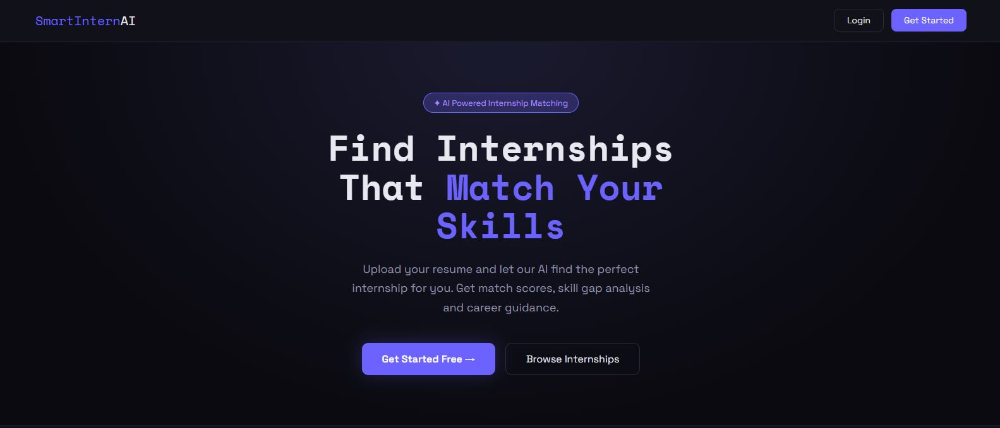
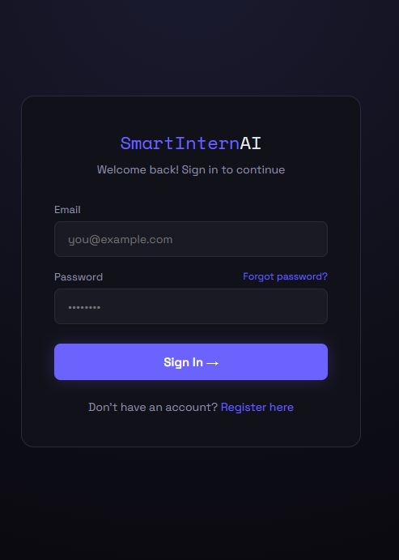
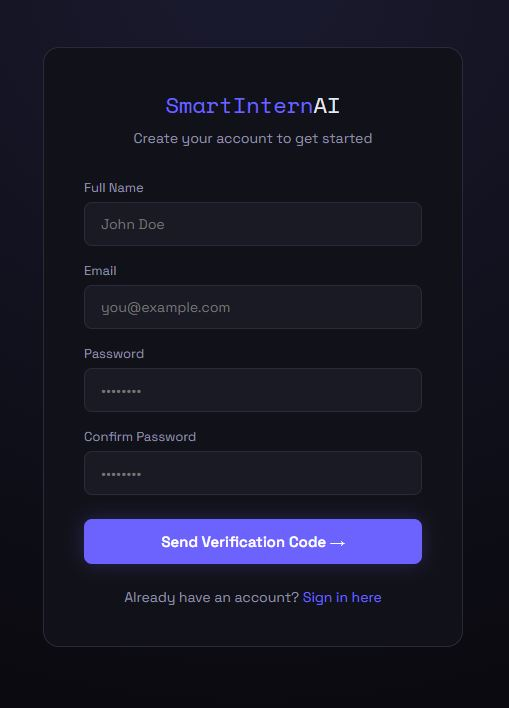
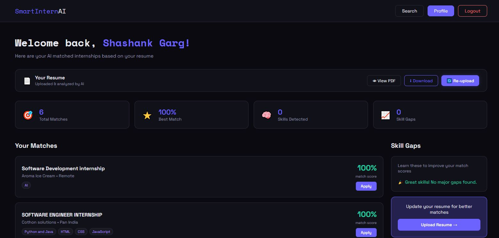
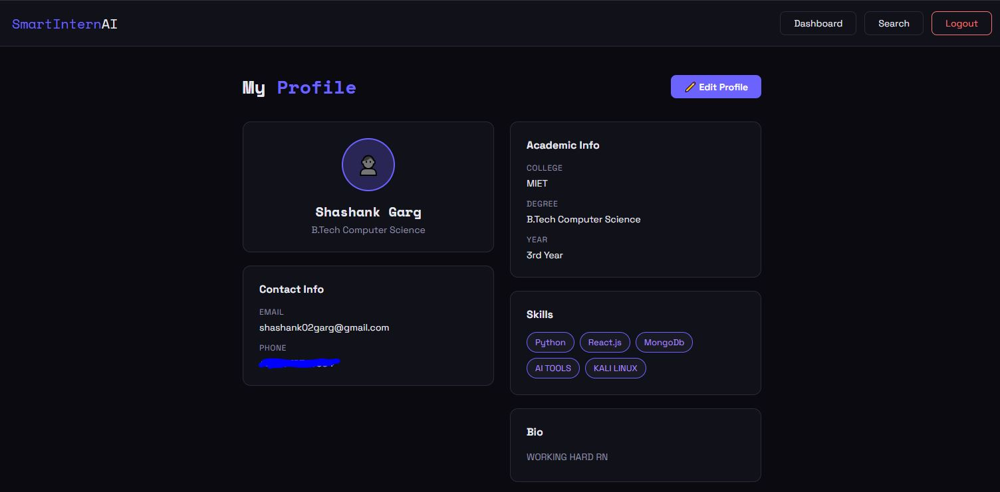

# 🚀 SmartIntern AI

An AI-powered internship matching platform that helps students discover relevant internships based on their skills and resume.

🌐 Live Demo:
https://smartintern-ai.vercel.app

## Features

- 🔐 JWT Authentication
- 📧 OTP Email Verification
- 📄 Resume Upload
- 🤖 AI Skill Matching
- 🎯 Personalized Internship Recommendations
- 🗄 MongoDB Database

## Tech Stack

Frontend
- React
- TypeScript
- Vite

Backend
- Flask
- Python

Database
- MongoDB

Deployment
- Vercel
- Render

## 📸 Screenshots

### 🏠 Home

  

### 📝 Login & Register

  
  

### 📝 Dashboard

  

### 👤 Profile

  

### Installation

git clone https://github.com/Shashank02-08/smartintern-ai.git

cd smartintern-ai

npm install

npm run dev

## Backend Repository

👉 https://github.com/Shashank02-08/smartintern-backend
